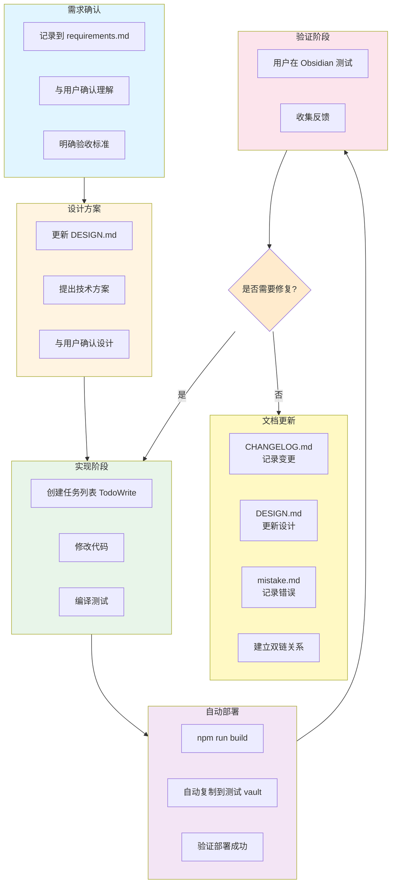
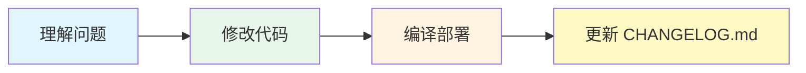
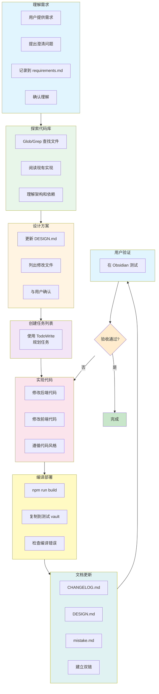
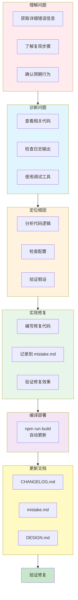
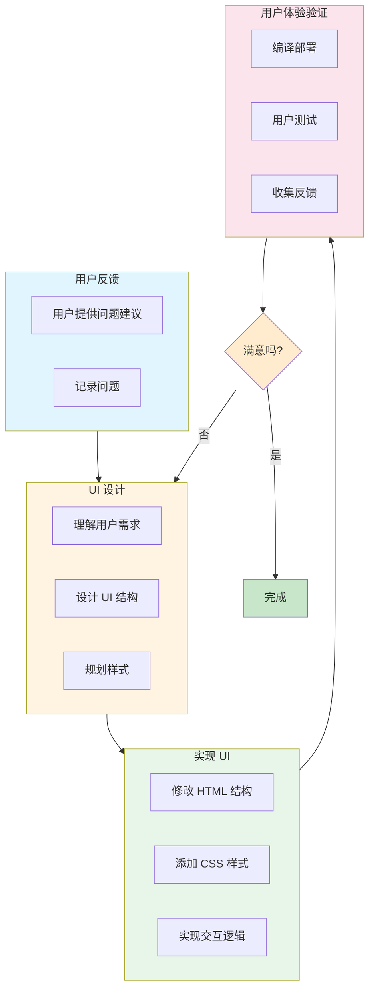
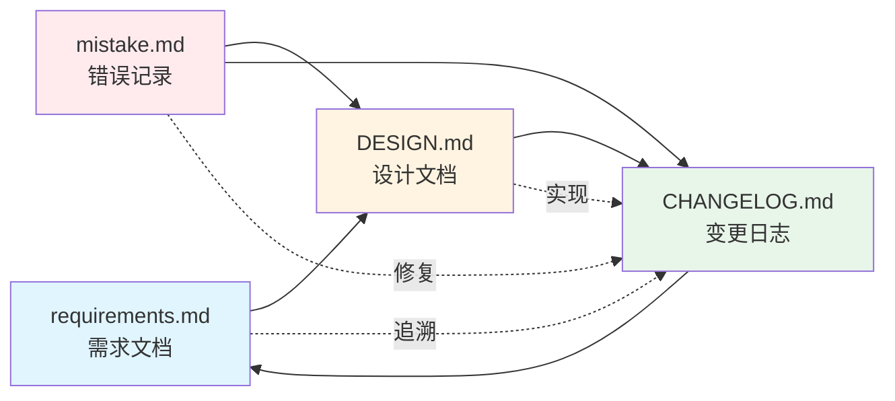
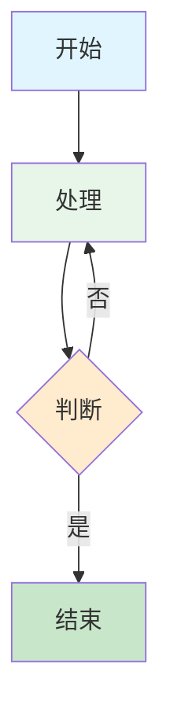

# TrendRadar 工作流程规范

本文档定义 TrendRadar 项目的标准工作流程和开发规范。

---

## 📋 目录

- [标准开发流程](#标准开发流程)
- [开发原则](#开发原则)
- [工作流程模板](#工作流程模板)
- [文档规范](#文档规范)

---

## 🔄 标准开发流程

### 完整开发循环



**文本版本**：

```
1. 需求确认
   ├─> 在 [[requirements.md]] 中记录需求
   ├─> 与用户确认理解
   └─> 明确验收标准

2. 设计方案
   ├─> 更新 [[DESIGN.md]]（如需要）
   ├─> 提出技术方案
   └─> 与用户确认设计

3. 实现阶段
   ├─> 创建任务列表（TodoWrite）
   ├─> 修改代码
   └─> 编译测试

4. 自动部署
   ├─> npm run build
   ├─> 自动复制到测试 vault
   └─> 验证部署成功

5. 验证阶段
   ├─> 用户在 Obsidian 中测试
   ├─> 收集反馈
   └─> 修复问题（如需要）

6. 文档更新（必须！）
   ├─> [[CHANGELOG.md]] - 记录本次变更
   ├─> [[DESIGN.md]] - 更新设计文档（如需要）
   ├─> [[mistake.md]] - 记录遇到的错误（如有）
   └─> 建立双链关系
```

### 快速修复流程

对于简单修复，可以简化流程：



**文本版本**：

```
1. 理解问题
2. 修改代码
3. 编译部署
4. 更新 [[CHANGELOG.md]]
```

---

## 📐 开发原则

### 核心原则

1. **前端优先原则**
   - 凡是业务相关、用户使用过程中会修改的配置，都应通过前端界面配置
   - 不应要求用户手动编辑配置文件

2. **完整性原则**
   - 功能要完整实现，不能只做一半
   - 后端和前端要同步完成
   - 编译后要部署到测试环境

3. **一致性原则**
   - 同一功能的参数要保持一致
   - 不同地方的同一功能要有相同的配置项
   - 样式和交互要统一

4. **Apple 设计风格**
   - 界面简洁、紧凑
   - 圆角、阴影、流畅动画
   - 清晰的层次结构

5. **逻辑顺序原则**
   - 配置先配置基础资源，再组合使用
   - Tab 顺序按照使用流程排列

### 代码开发原则

1. **最小改动原则**
   - 只修改必要的代码
   - 避免过度重构
   - 保持向后兼容

2. **保持一致性**
   - 遵循现有代码风格
   - 遵循现有的架构模式

3. **即时测试**
   - 修改后立即验证
   - 使用自动部署加速验证

4. **向后兼容**
   - 数据结构变更要考虑迁移
   - 保留旧配置的兼容性

---

## 📝 工作流程模板

### 处理新功能请求



**文本版本**：

```
1. 理解需求
   ├─> 用户提供需求
   ├─> 提出澄清问题（如有需要）
   ├─> 记录到 [[requirements.md]]
   └─> 确认理解

2. 探索代码库
   ├─> 使用 Glob/Grep 查找相关文件
   ├─> 阅读现有实现
   └─> 理解架构和依赖

3. 设计方案
   ├─> 更新 [[DESIGN.md]]
   ├─> 列出需要修改的文件
   └─> 与用户确认

4. 创建任务列表
   └─> 使用 TodoWrite 规划任务

5. 实现代码
   ├─> 修改后端代码（如需要）
   ├─> 修改前端代码
   └─> 遵循现有代码风格

6. 编译部署
   ├─> 运行 npm run build
   ├─> 自动复制到测试 vault
   └─> 检查编译错误

7. 文档更新（重要！）
   ├─> [[CHANGELOG.md]] - 记录变更
   ├─> [[DESIGN.md]] - 更新设计
   ├─> [[mistake.md]] - 记录错误（如有）
   └─> 建立双链关系

8. 用户验证
   └─> 在 Obsidian 中测试功能
```

---

### 处理 Bug 报告



**文本版本**：

```
1. 理解问题
   ├─> 获取详细的错误信息
   ├─> 了解复现步骤
   └─> 确认预期行为

2. 诊断问题
   ├─> 查看相关代码
   ├─> 检查日志输出
   └─> 使用调试工具

3. 定位根因
   ├─> 分析代码逻辑
   ├─> 检查配置是否正确
   └─> 验证假设

4. 实现修复
   ├─> 编写修复代码
   ├─> 记录到 [[mistake.md]]
   └─> 验证修复效果

5. 编译部署
   └─> npm run build（自动更新）

6. 更新文档
   ├─> [[CHANGELOG.md]] - 记录修复
   ├─> [[mistake.md]] - 记录错误案例
   └─> [[DESIGN.md]] - 更新设计（如需要）
```

---

### UI 优化流程



**文本版本**：

```
1. 用户反馈
   ├─> 用户提供 UI 问题和建议
   └─> 记录问题

2. UI 设计
   ├─> 理解用户需求（如 Apple 风格）
   ├─> 设计 UI 结构
   └─> 规划样式

3. 实现 UI
   ├─> 修改 HTML 结构
   ├─> 添加 CSS 样式
   └─> 实现交互逻辑

4. 用户体验验证
   ├─> 编译部署
   ├─> 用户在 Obsidian 中测试
   └─> 收集反馈

5. 迭代优化
   ├─> 根据反馈调整
   ├─> 重新编译部署
   └─> 持续改进
```

---

## 📚 文档规范

### 文档体系

项目使用以下文档体系：

1. **[[requirements.md]]** - 需求文档
   - 记录功能需求和非功能需求
   - 用户需求和验收标准
   - 需求优先级和状态

2. **[[DESIGN.md]]** - 设计文档
   - 架构设计
   - 技术方案
   - 设计决策和原因

3. **[[CHANGELOG.md]]** - 变更日志
   - 每次变更的详细记录
   - 问题、修复、验证结果
   - 按时间倒序排列

4. **[[mistake.md]]** - 错误记录
   - 具体错误案例
   - 根本原因分析
   - 解决方案和教训

5. **[[workflow.md]]** - 本文档
   - 工作流程规范
   - 开发原则
   - 工作模板

### 双链关系规范

使用 Obsidian 双链语法建立文档之间的关联：



**关系说明**：

- **requirements.md → DESIGN.md**：需求导出设计
- **DESIGN.md → CHANGELOG.md**：设计实现变更
- **CHANGELOG.md → requirements.md**：变更追溯需求
- **mistake.md → DESIGN.md**：错误影响设计
- **mistake.md → CHANGELOG.md**：错误记录到变更

**文本版本**：

```
requirements.md → DESIGN.md → CHANGELOG.md
       ↓                ↓            ↓
   需求导出设计      设计实现变更   变更追溯需求
       ↓                ↓            ↓
   mistake.md ←──┴──── CHANGELOG.md
      错误影响设计/代码
```

**双链使用示例**：

在 CHANGELOG.md 中：
```markdown
## [2026-01-11] 修复数据源删除功能

**问题**：通过配置界面删除数据源时，虽然前端显示删除成功，但配置文件中的数据源并未实际删除

**相关需求**：[[requirements.md#数据源管理]]

**相关设计**：[[DESIGN.md#数据源分组架构]]

**相关错误**：[[mistake.md#数据源删除失效]]
```

在 requirements.md 中：
```markdown
## 数据源管理

**状态**：✅ 已实现

**相关设计**：[[DESIGN.md#数据源分组架构]]

**相关变更**：[[CHANGELOG.md#2026-01-11]]
```

### 文档更新时机

| 文档 | 更新时机 |
|------|---------|
| requirements.md | 收到新需求时 |
| DESIGN.md | 架构变更或设计决策时 |
| CHANGELOG.md | 每次代码变更后（必须！） |
| mistake.md | 遇到错误并修复后 |
| workflow.md | 工作流程优化时 |

### 文档格式规范

**CHANGELOG.md 格式**：
```markdown
## [日期] 变更标题

### 🐛 Bug Fixes / 🚀 Features / ♻️ Refactor

**问题描述**（如果是 bug）
**相关需求**：[[requirements.md#xxx]]
**相关设计**：[[DESIGN.md#xxx]]

**修复内容**：
- 修改了文件
- 具体改动

**验证结果**：
- ✅ 验证项1
- ✅ 验证项2
```

**requirements.md 格式**：
```markdown
## 需求标题

**类型**：功能 / 非功能 / 优化
**优先级**：高 / 中 / 低
**状态**：待讨论 / 设计中 / 开发中 / 已实现 / 已取消

**用户需求**：
> 用户原始需求

**验收标准**：
- [ ] 标准1
- [ ] 标准2

**相关设计**：[[DESIGN.md#xxx]]
**相关变更**：[[CHANGELOG.md#xxx]]
```

**mistake.md 格式**：
```markdown
## 错误标题

**发生时间**：YYYY-MM-DD
**影响范围**：模块/功能

**错误现象**：
- 现象1
- 现象2

**根本原因**：
分析根本原因

**解决方案**：
如何修复

**经验教训**：
- 教训1
- 教训2

**相关变更**：[[CHANGELOG.md#xxx]]
**相关设计**：[[DESIGN.md#xxx]]
```

---

## 📅 更新记录

### 2026-01-11
- 重新定位 workflow.md 为工作流程规范
- 移除了不属于 workflow 的具体交互场景
- 添加了文档规范和双链关系说明
- 明确了各文档的定位和用途
- **添加 Mermaid 流程图**：
  - 完整开发循环流程图
  - 快速修复流程图
  - 处理新功能请求流程图
  - 处理 Bug 报告流程图
  - UI 优化流程图
  - 文档关系图

---

*本文档随项目发展持续更新中*

## 💡 使用说明

### Mermaid 流程图查看

在 Obsidian 中查看本文档时：
1. **预览模式**：流程图会自动渲染为可视化图形
2. **编辑模式**：看到的是 Mermaid 代码块
3. **实时更新**：修改代码后，切换到预览模式即可看到更新

### 流程图特点

- **颜色编码**：每个阶段使用不同颜色区分
- **子图展开**：点击子图可查看详细步骤
- **循环反馈**：包含判断节点和循环流程
- **双链集成**：流程中引用相关文档

### 自定义流程图

如需创建自定义流程图，使用以下模板：



更多 Mermaid 语法：https://mermaid.js.org/

